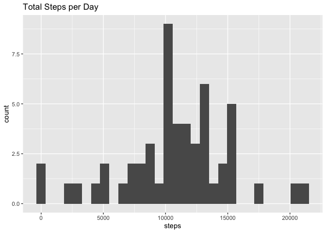
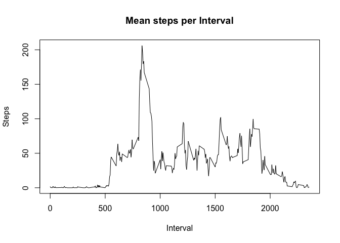
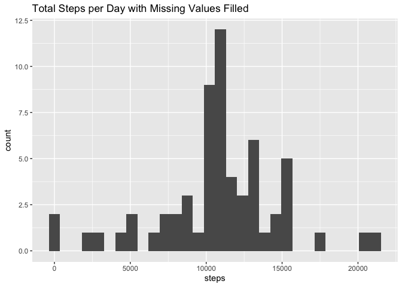
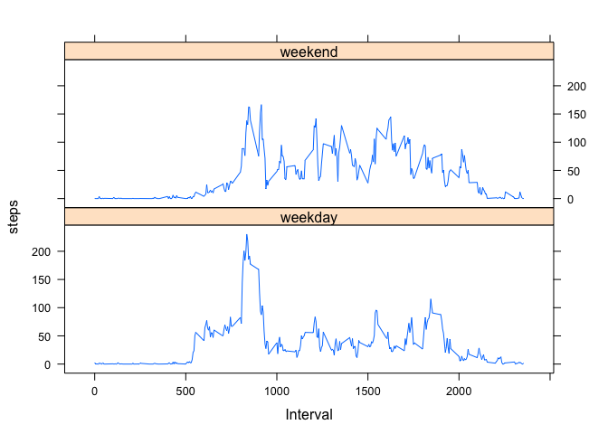

## Loading and preprocessing the data

First we will read the data file into memory and store it in a data frame `df`.

```r
df <- read.csv("activity.csv")
```

## What is mean total number of steps taken per day?

We find the total number of steps taken per day and plot a histogram.


```r
totalSteps <- aggregate(df["steps"], FUN = sum, by=list(Date = df$date), na.rm=FALSE)

library(ggplot2)
ggplot(totalSteps, aes(x=steps)) + geom_histogram(bins=30) + labs(title="Total Steps per Day")
```

```
## Warning: Removed 8 rows containing non-finite values (stat_bin).
```

<!-- -->

Now we find the mean and median number of steps taken per day.


```r
meanSteps <- mean(totalSteps$steps, na.rm=TRUE)
medianSteps <- median(totalSteps$steps, na.rm=TRUE)
```

The mean steps per day is 10766 and the median is 10765.

## What is the average daily activity pattern?

Let's create a time series graph using the base plotting system showing steps
taken per five minute interval.


```r
byinterval <- aggregate(df["steps"], FUN = mean, by=list(Interval = df$interval), na.rm=TRUE)

plot(byinterval$Interval, byinterval$steps, type="l", xlab="Interval", ylab="Steps", main="Mean steps per Interval")
```

<!-- -->

We can find the interval in which the maximum number of steps was taken.


```r
maxInterval <- byinterval[which.max(byinterval$steps),"Interval"]
```

The interval in which the maximum number of steps was taken is 835.

## Imputing missing values

The data contains missing values. Let's find the number of missing values.


```r
numNA <- sum(is.na(df))
```

There are 2304 missing values.

Now, we can make a new data frame with the missing values filled in by the
average number of steps taken for that interval on other days.


```r
filledDF <- df
filledDF[is.na(df)] <- byinterval[match(df[which(is.na(df), arr.ind=TRUE)[,1],3], byinterval$Interval),"steps"]
```

Re-create the histogram using the filled-in values.


```r
totalStepsFilled <- aggregate(filledDF["steps"], FUN = sum, by=list(Date = filledDF$date))

ggplot(totalStepsFilled, aes(x=steps)) + geom_histogram(bins=30) + labs(title="Total Steps per Day with Missing Values Filled")
```

<!-- -->

And we can find the new mean and median number of steps.


```r
meanStepsFilled <- mean(totalStepsFilled$steps)
medianStepsFilled <- median(totalStepsFilled$steps)
```

The new mean steps per day is 10766 and the median is
10766 (vs. 10766 and 10765). The overall distribution
of steps remains largely unchanged from the original data set, which indicates
that this method of imputing missing values did not skew the data significantly.

## Are there differences in activity patterns between weekdays and weekends?

First add a column to the data frame signifying either 'weekday' or 'weekend'.

```r
filledDF$weekday <- as.factor(ifelse(weekdays(as.Date(df$date, "%Y-%m-%d")) %in% c("Saturday", "Sunday"), "weekend", "weekday"))
```

We can now create a panel plot shows activity patterns on weekdays vs. weekends.


```r
byintervalFilled <- aggregate(filledDF["steps"], FUN = mean, by=list(Interval = filledDF$interval, weekday = filledDF$weekday), na.rm=TRUE)

library(lattice)
xyplot(steps ~ Interval | weekday, data=byintervalFilled, type="l", layout=c(1,2))
```

<!-- -->

The plots show that the steps are distributed differently throughout the day
on weekends and weekdays. There is a large spike in the number of steps early
in the day on weekdays. In contrast, the steps are more evenly distributed on
weekends.
